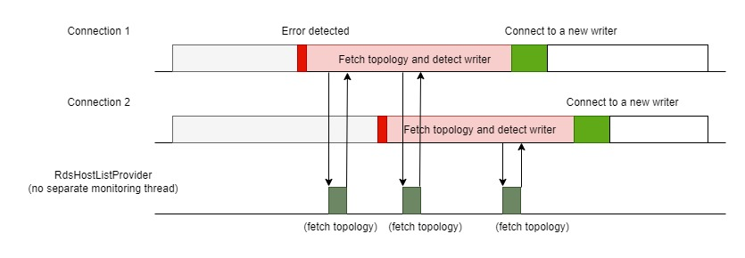
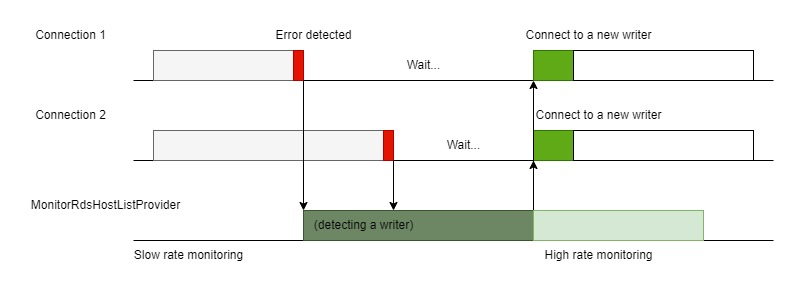
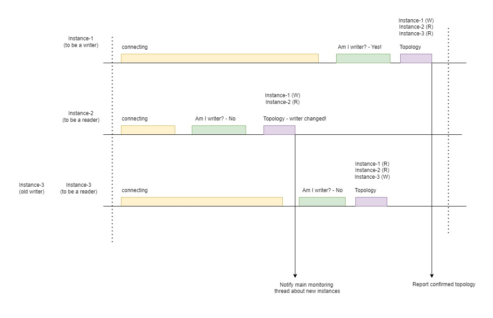

# Failover Plugin v2
The AWS Advanced JDBC Driver uses the Failover Plugin v2 to provide minimal downtime in the event of a DB instance failure. The plugin is the next version (v2) of the [Failover Plugin](./UsingTheFailoverPlugin.md) and unless explicitly stated otherwise, most of the information and suggestions for the Failover Plugin are applicable to the Failover Plugin v2.

## Differences between the Failover Plugin and the Failover Plugin v2

The Failover Plugin performs a failover process for each DB connection. Each failover process is triggered independently and is unrelated to failover processes in other connections. While such independence between failover processes has some benefits, it also leads to additional resources like extra threads. If dozens of DB connections are failing over at the same time, it may cause significant load on a client environment.

<i>Picture 1. Each connection triggers its own failover process to detect a new writer.</i>
  

If a connection needs to get the latest topology, it calls `RdsHostListProvider`. It should be noted that `RdsHostListProvider` runs in the same thread as a connection failover process. As shown in _Picture 1_ above, different connections start and end their failover processes independently.

The Failover Plugin v2 uses an optimized approach where the process of detecting and confirming a cluster topology is delegated to a central topology monitoring component that runs in a separate thread. When the topology is confirmed and a new writer is detected, each waiting connection can resume and reconnect to a required node. This design helps minimize resources required for failover processing and scales better compared to the Failover Plugin.

<i>Picture 2. Connections call MonitoringRdsHostListProvider, which is responsible for detecting the new writer. While waiting for MonitoringRdsHostListProvider, connection threads suspend.</i>
  

If two connections encounter communication issues with their internal (physical) DB connections, each connection may send a request to the topology monitoring component (`MonitoringRdsHostListProvider` in _Picture 2_) for updated topology information reflecting the new writer. Both connections are notified as soon as the latest topology is available. Connection threads can resume, continue with their suspended workflows, and reconnect to a reader or a writer node as needed.

The topology monitoring component mentioned above (`MonitoringRdsHostListProvider`) updates topology periodically. Usually it uses a connection to a writer node to fetch a cluster topology. Using a connection to a writer node allows to get topology from the first hand without a risk of getting stale data as in case of fetching it from a reader. In some exceptional cases the monitoring component may (temporarily) use a reader connection to fetch a topology however it switch back to a writer node as soon as possible.

<i>Picture 3. MonitoringRdsHostListProvider detects a new writer by establishing connections to nodes in separate threads.</i> 
  

When the cluster topology needs to be confirmed, the monitoring component opens new threads, one for each node (see _Picture 3_). Each of these threads tries to connect to a node and checks if the node is a writer. Aurora clusters are architected in a way such that a writer node gets updated first and provides the true topology. Other nodes connect to a new writer shortly after and they update their local copies of the topology. When reading the topology from a reader node, it's quite possible to get a stale topology for a short time period after failover. You can see a typical stale topology on a diagram above, thread `instance-3`, box `Topology` to the right. The topology shows that `instance-3` is still a writer there.

TThe threads monitoring the topology stop when a new writer is detected. For 30 seconds after a new writer is detected (and after all waiting connections have been notified), topology continues to be updated at an increased rate. This allows time for all readers to appear in the topology, since 30 seconds is usually enough time for cluster failover to complete and cluster topology to stabilize.

All improvements mentioned above help Failover Plugin v2 to perform with a better performance and less resources. 

To summarize facts about `failover` and `failover2` plugins and highlight the differences between them,
with `failover` plugin:
- Each connection performs its own failover process.
- Each connection fetches topology by calling `RdsHostListProvider` in the same thread.
- Topology may be fetched from a reader node and it may be stale.

With `failover2` plugin:
- Each connection delegates a new writer detection to `MonitoringRdsHostListProvider` (that runs in its own thread) and suspends until new a writer is confirmed.
- `MonitoringRdsHostListProvider` tries to connect to every cluster node in parallel.
- `MonitoringRdsHostListProvider` uses "Am I writer?" approach to avoid getting a stale topology.
- `MonitoringRdsHostListProvider` continues topology monitoring with a high rate to ensure all cluster nodes appear in topology.

## Using the Failover Plugin v2
The Failover Plugin v2 will **NOT** be enabled by default. The failover plugin has to be explicitly included by adding the plugin code `failover2` to the [`wrapperPlugins`](../UsingTheJdbcDriver.md#aws-advanced-jdbc-driver-parameters) value, or by adding it to the current [driver profile](../UsingTheJdbcDriver.md#connection-plugin-manager-parameters). After you load the plugin, the failover feature will be enabled. 

Please refer to the [failover configuration guide](../FailoverConfigurationGuide.md) for tips to keep in mind when using the failover plugin.

> [!WARNING]
> Do not use `failover` and `failover2` plugins at the same time for the same connection! 

### Failover Plugin v2 Configuration Parameters
In addition to the parameters that you can configure for the underlying driver, you can pass the following parameters to the AWS JDBC Driver through the connection URL to specify additional failover behavior.

| Parameter                             |  Value  |                                     Required                                     | Description                                                                                                                                                                                                                                                                                                                                                                                                                                                                                                                                                                                                                                                                                                                                                                                                                                                                                                                                                                                                          | Default Value                                                                                                                                                                                       |
|---------------------------------------|:-------:|:--------------------------------------------------------------------------------:|:---------------------------------------------------------------------------------------------------------------------------------------------------------------------------------------------------------------------------------------------------------------------------------------------------------------------------------------------------------------------------------------------------------------------------------------------------------------------------------------------------------------------------------------------------------------------------------------------------------------------------------------------------------------------------------------------------------------------------------------------------------------------------------------------------------------------------------------------------------------------------------------------------------------------------------------------------------------------------------------------------------------------|-----------------------------------------------------------------------------------------------------------------------------------------------------------------------------------------------------|
| `failoverMode`                        | String  |                                        No                                        | Defines a mode for failover process. Failover process may prioritize nodes with different roles and connect to them. Possible values:   - `strict-writer` - Failover process follows writer node and connects to a new writer when it changes. - `reader-or-writer` - During failover, the driver tries to connect to any available/accessible reader node. If no reader is available, the driver will connect to a writer node. This logic mimics the logic of the Aurora read-only cluster endpoint. - `strict-reader` - During failover, the driver tries to connect to any available reader node. If no reader is available, the driver raises an error. Reader failover to a writer node will only be allowed for single-node clusters. This logic mimics the logic of the Aurora read-only cluster endpoint.  If this parameter is omitted, default value depends on connection url. For Aurora read-only cluster endpoint, it's set to `reader-or-writer`. Otherwise, it's `strict-writer`. | Default value depends on connection url. For Aurora read-only cluster endpoint, it's set to `reader-or-writer`. Otherwise, it's `strict-writer`.                                                    |
| `clusterInstanceHostPattern`          | String  | If connecting using an IP address or custom domain URL: Yes  Otherwise: No | This parameter is not required unless connecting to an AWS RDS cluster via an IP address or custom domain URL. In those cases, this parameter specifies the cluster instance DNS pattern that will be used to build a complete instance endpoint. A "?" character in this pattern should be used as a placeholder for the DB instance identifiers of the instances in the cluster. See [here](#host-pattern) for more information.   Example: `?.my-domain.com`, `any-subdomain.?.my-domain.com:9999`  Use case Example: If your cluster instance endpoints follow this pattern:`instanceIdentifier1.customHost`, `instanceIdentifier2.customHost`, etc. and you want your initial connection to be to `customHost:1234`, then your connection string should look like this: `jdbc:aws-wrapper:mysql://customHost:1234/test?clusterInstanceHostPattern=?.customHost`                                                                                                                                 | If the provided connection string is not an IP address or custom domain, the JDBC Driver will automatically acquire the cluster instance host pattern from the customer-provided connection string. |
| `clusterTopologyHighRefreshRateMs`    | Integer |                                        No                                        | Cluster topology refresh rate in milliseconds when a cluster is not in failover. It refers to `slow monitoring rate` as explained above.                                                                                                                                                                                                                                                                                                                                                                                                                                                                                                                                                                                                                                                                                                                                                                                                                                                                             | `30000`                                                                                                                                                                                             |
| `failoverTimeoutMs`                   | Integer |                                        No                                        | Maximum allowed time in milliseconds to attempt reconnecting to a new writer or reader instance after a cluster failover is initiated.                                                                                                                                                                                                                                                                                                                                                                                                                                                                                                                                                                                                                                                                                                                                                                                                                                                                               | `300000`                                                                                                                                                                                            |
| `clusterTopologyHighRefreshRateMs`    | Integer |                                        No                                        | Interval of time in milliseconds to wait between attempts to update cluster topology. It corresponds to `high rate monitoring` described earlier. Usually, topology monitoring component uses high rate monitoring for 30s after a new writer was detected.                                                                                                                                                                                                                                                                                                                                                                                                                                                                                                                                                                                                                                                                                                                                                          | `100`                                                                                                                                                                                               |
| `failoverReaderHostSelectorStrategy`  | String  |                                        No                                        | Allows to chose a desired strategy to select a reader node during failover. For more information on the available reader selection strategies, see this [table](../ReaderSelectionStrategies.md).                                                                                                                                                                                                                                                                                                                                                                                                                                                                                                                                                                                                                                                                                                                                                                                                                    | `random`                                                                                                                                                                                            |
| `clusterId`                           | String  |                                        No                                        | A unique identifier for the cluster. Connections with the same cluster id share a cluster topology cache.                                                                                                                                                                                                                                                                                                                                                                                                                                                                                                                                                                                                                                                                                                                                                                                                                                                                                                            | None                                                                                                                                                                                                |
| `telemetryFailoverAdditionalTopTrace` | Boolean |                                        No                                        | Allows the driver to produce an additional telemetry span associated with failover. Such span helps to facilitate telemetry analysis in AWS CloudWatch.                                                                                                                                                                                                                                                                                                                                                                                                                                                                                                                                                                                                                                                                                                                                                                                                                                                              | `false`                                                                                                                                                                                             | 

Please refer to [Failover Plugin](./UsingTheFailoverPlugin.md) for more details about error codes, configurations, connection pooling and sample codes. 

### Sample Code
[PostgreSQL Failover Sample Code](./../../../examples/AWSDriverExample/src/main/java/software/amazon/PgFailoverSample.java)

This sample code uses the original `failover` plugin, but it can also be used with the `failover2` plugin. Configuration parameters should be adjusted in accordance with the table above. 

